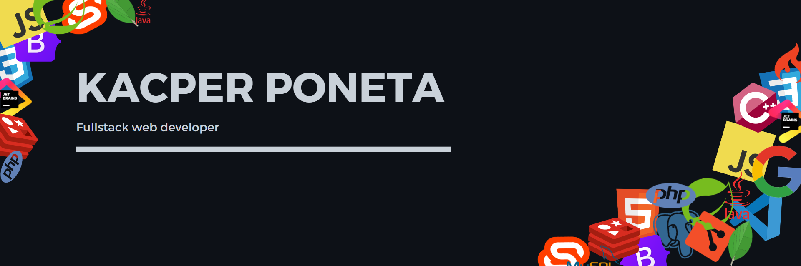

## 🧑‍💻About Me:
👋 passionate software dev from Poland  
💼 web developer at [ArteriaCS](http://arteriacs.pl)  
❤️ love writing , reading Code and learning new skills  
📫 `poneciak@gmail.com`

---

## 🛠️Languages and tools: 

     

---

## :fire: My stats:

<!---
poneciak57/poneciak57 is a ✨ special ✨ repository because its `README.md` (this file) appears on your GitHub profile.
You can click the Preview link to take a look at your changes.
--->
